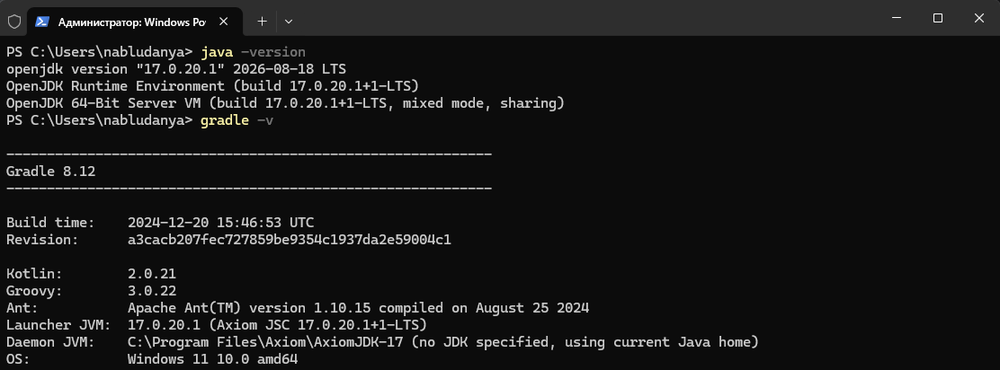
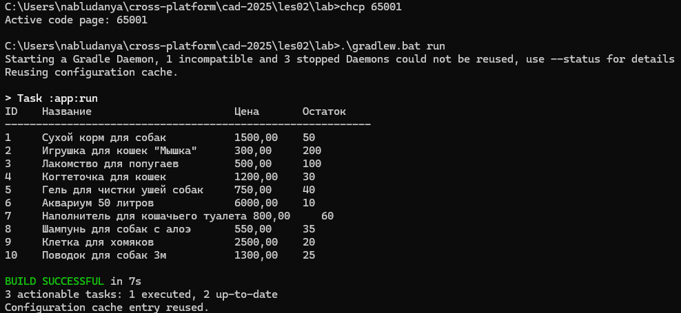

# Отчет о лабораторной работе №1

## Цель работы

Создание каркаса Spring-приложения с использованием Java-конфигурации,
освоение инструмента сборки Gradle, реализация загрузчика CSV-файлов
для последующего использования в проекте «Магазин товаров для животных».

## Выполнение работы

1. Скачаны дистрибутивы с официального сайта, выполнена установка (Рис.1).



<div>Рисунок 1 - Установка дистрибутивов Axiom, Gradle, Java</div>

2. С помощью команды `gradle init --package ru.bsuedu.cad.lab` был создан
   каркас проекта.

```
C:\Users\nabludanya\cross-platform\cad-2025\les02\lab>tree /F
Структура папок тома Windows
C:.
│   .gitattributes
│   .gitignore
│   chcp
│   gradle.properties
│   gradlew
│   gradlew.bat
│   gradle_run.png
│   gradle.png
│   README.md
│   settings.gradle.kts
│
├───app
│   │   build.gradle.kts
│   │
│   └───src
│       └───main
│           ├───java
│           │   └───ru
│           │       └───bsuedu
│           │           └───cad
│           │               └───lab
│           │                       App.java
│           │                       AppConfig.java
│           │                       ConcreteProductProvider.java
│           │                       ConsoleTableRenderer.java
│           │                       CSVParser.java
│           │                       Parser.java
│           │                       Product.java
│           │                       ProductProvider.java
│           │                       Reader.java
│           │                       Renderer.java
│           │                       ResourceFileReader.java
│           │
│           └───resources
│                   product.csv
│
└───gradle
    │   libs.versions.toml
    │
    └───wrapper
            gradle-wrapper.jar
            gradle-wrapper.properties
```

3. Добавлена библиотека *org.springframework:spring-context:6.2.2*.

## Реализация

Класс `Product`:

```java
package ru.bsuedu.cad.lab;

public class Product {
    private long id;
    private String name;
    private String description;
    private double price;
    private int stockQuantity;

    public Product(long id, String name, String description,
                   double price, int stockQuantity) {
        this.id = id;
        this.name = name;
        this.description = description;
        this.price = price;
        this.stockQuantity = stockQuantity;
    }

    public long getId() { return id; }
    public String getName() { return name; }
    public String getDescription() { return description; }
    public double getPrice() { return price; }
    public int getStockQuantity() { return stockQuantity; }
}
```

Файл `build.gradle.kts`:

```kotlin
/*
 * This file was generated by the Gradle 'init' task.
 *
 * This generated file contains a sample Java application project to get you started.
 * For more details on building Java & JVM projects, please refer to https://docs.gradle.org/8.12/userguide/building_java_projects.html in the Gradle documentation.
 * This project uses @Incubating APIs which are subject to change.
 */

plugins {
    // Apply the application plugin to add support for building a CLI application in Java.
    application
}

repositories {
    // Use Maven Central for resolving dependencies.
    mavenCentral()
}

dependencies {
    // This dependency is used by the application.
    implementation(libs.guava)
    // Source: https://mvnrepository.com/artifact/org.springframework/spring-context
    implementation("org.springframework:spring-context:6.2.2")
}

testing {
    suites {
        // Configure the built-in test suite
        val test by getting(JvmTestSuite::class) {
            // Use JUnit Jupiter test framework
            useJUnitJupiter("5.11.1")
        }
    }
}

// Apply a specific Java toolchain to ease working on different environments.
java {
    toolchain {
        languageVersion = JavaLanguageVersion.of(17)
    }
}

application {
    // Define the main class for the application.
    mainClass = "ru.bsuedu.cad.lab.App"
}

tasks.withType<JavaExec> {
    jvmArgs("-Dfile.encoding=UTF-8")
    standardOutput = System.out
    errorOutput = System.err
}
tasks.withType<JavaCompile> {
    options.encoding = "UTF-8"
}
```

Конфигурация приложения `AppConfig`:

```java
package ru.bsuedu.cad.lab;

import org.springframework.context.annotation.Bean;
import org.springframework.context.annotation.Configuration;

@Configuration
public class AppConfig
{
    @Bean
    public Reader reader() {
        return new ResourceFileReader("product.csv");
    }

    @Bean
    public Parser parser() {
        return new CSVParser();
    }

    @Bean
    public ProductProvider productProvider(
            Reader reader,
            Parser parser
    ) {
        return new ConcreteProductProvider(reader, parser);
    }

    @Bean
    public Renderer renderer() {
        return new ConsoleTableRenderer();
    }
}
```

## Запуск приложения

Из директории проекта выполните:

```
gradle run
```

Либо через Gradle Wrapper (рекомендуется, если системный Gradle не установлен):

```
gradlew.bat run
```

Приложение прочитает файл `product.csv` из `src/main/resources`
и выведет таблицу товаров в консоль.

## Результат работы



## Выводы

В ходе выполнения работы был создан базовый каркас Spring-приложения
для магазина товаров для животных.
Освоены инструменты Gradle 8.12 и JDK 17,
реализована Java-конфигурация Spring-контекста.
Разработаны основные компоненты согласно диаграмме классов:
`Reader` для чтения CSV-файла из ресурсов,
`Parser` для парсинга данных,
`ProductProvider` для предоставления списка товаров и
`Renderer` для вывода таблицы в консоль.

Приложение успешно запускается командой `gradle run`,
читает данные из `product.csv` и
корректно отображает их в виде
форматированной таблицы.