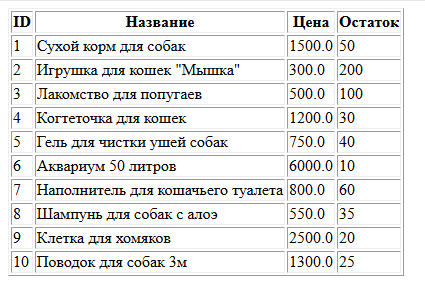
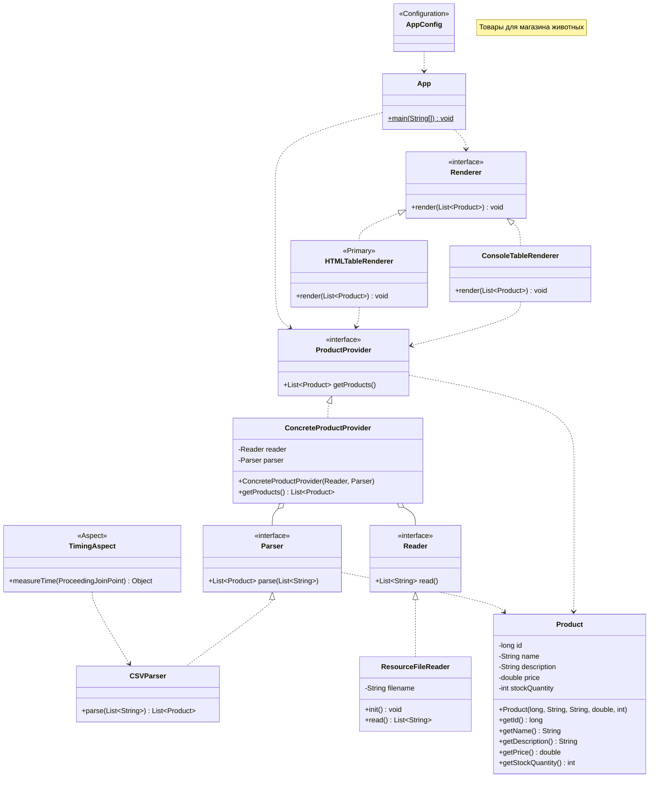

# Отчет о лабораторной работе №2
## Выполнение работы
### Создан новый класс HTMLTableRenderer
```
package ru.bsuedu.cad.lab;

import org.springframework.context.annotation.Primary;
import org.springframework.stereotype.Component;

import java.io.FileWriter;
import java.util.List;

@Component
@Primary
public class HTMLTableRenderer implements Renderer {

    @Override
    public void render(List<Product> products) {
        try (FileWriter writer = new FileWriter("product.html")) {

            writer.write("<html><body>");
            writer.write("<table border='1'>");
            writer.write("<tr><th>ID</th><th>Название</th><th>Цена</th><th>Остаток</th></tr>");

            for (Product p : products) {
                writer.write("<tr>");
                writer.write("<td>" + p.getId() + "</td>");
                writer.write("<td>" + p.getName() + "</td>");
                writer.write("<td>" + p.getPrice() + "</td>");
                writer.write("<td>" + p.getStockQuantity() + "</td>");
                writer.write("</tr>");
            }

            writer.write("</table>");
            writer.write("</body></html>");

            System.out.println("Файл создан: product.html");

        } catch (Exception e) {
            throw new RuntimeException(e);
        }
    }
}
```
### Создан новый класс TimingAspect
```
package ru.bsuedu.cad.lab;

import org.aspectj.lang.ProceedingJoinPoint;
import org.aspectj.lang.annotation.Around;
import org.aspectj.lang.annotation.Aspect;
import org.springframework.stereotype.Component;

@Aspect
@Component
public class TimingAspect
{
    @Around("execution(* ru.bsuedu.cad.lab.CSVParser.parse(..))")
    public Object measureTime(ProceedingJoinPoint joinPoint) throws Throwable {

        long start = System.currentTimeMillis();

        Object result = joinPoint.proceed();

        long end = System.currentTimeMillis();

        System.out.println("Время парсинга CSV: "
                + (end - start) + " мс");

        return result;
    }
}
```
### Сборка проекта
```
PS C:\Users\nabludanya\cross-platform\cad-2025\les04\lab> gradle run
Starting a Gradle Daemon, 1 incompatible and 2 stopped Daemons could not be reused, use --status for details
Reusing configuration cache.

> Task :app:run
ResourceFileReader инициализирован: 2026-09-21T21:09:29.339855100
Время парсинга CSV: 2 мс
Файл создан: product.html

BUILD SUCCESSFUL in 7s
3 actionable tasks: 1 executed, 2 up-to-date
```
### Вывод в HTML-файл

<div>Рисунок 1 - Вывод в HTML-файл</div>

## Результат работы - Обновленная диаграмма классов
