# Отчет о лабораторной работе №4

## Выполнение работы

### Создан новый класс OrderApplication

```
package ru.bsuedu.cad.lab.app;

import org.slf4j.Logger;
import org.slf4j.LoggerFactory;
import org.springframework.context.annotation.AnnotationConfigApplicationContext;
import ru.bsuedu.cad.lab.config.AppConfig;
import ru.bsuedu.cad.lab.entity.Category;
import ru.bsuedu.cad.lab.entity.Customer;
import ru.bsuedu.cad.lab.entity.Order;
import ru.bsuedu.cad.lab.entity.Product;
import ru.bsuedu.cad.lab.repository.CategoryRepository;
import ru.bsuedu.cad.lab.repository.CustomerRepository;
import ru.bsuedu.cad.lab.repository.ProductRepository;
import ru.bsuedu.cad.lab.service.DataLoaderService;
import ru.bsuedu.cad.lab.service.OrderService;

import java.math.BigDecimal;
import java.util.Arrays;
import java.util.List;

public class OrderApplication {

    private static final Logger logger = LoggerFactory.getLogger(OrderApplication.class);

    public static void main(String[] args) {
        logger.info("=====================Запуск приложения=====================");

        try (AnnotationConfigApplicationContext context =
                     new AnnotationConfigApplicationContext(AppConfig.class)) {

            DataLoaderService dataLoaderService = context.getBean(DataLoaderService.class);
            OrderService orderService = context.getBean(OrderService.class);
            CategoryRepository categoryRepository = context.getBean(CategoryRepository.class);
            CustomerRepository customerRepository = context.getBean(CustomerRepository.class);
            ProductRepository productRepository = context.getBean(ProductRepository.class);

            logger.info("Загрузка первичных данных из CSV файлов...");
            dataLoaderService.loadAllData();

            logger.info("=====================Загруженные данные=====================");

            List<Category> categories = categoryRepository.findAll();
            logger.info("Категории ({}):", categories.size());
            for (Category c : categories) {
                logger.info("  {} - {}", c.getId(), c.getName());
            }

            List<Customer> customers = customerRepository.findAll();
            logger.info("Клиенты ({}):", customers.size());
            for (Customer c : customers) {
                logger.info("  {} - {} ({})", c.getId(), c.getName(), c.getEmail());
            }

            List<Product> products = productRepository.findAll();
            logger.info("Товары ({}):", products.size());
            for (Product p : products) {
                logger.info("  {} - {} ({} руб.) - остаток: {}",
                        p.getId(), p.getName(), p.getPrice(), p.getStockQuantity());
            }

            logger.info("=====================Создание нового заказа=====================");

            Customer customer = customers.get(0);
            logger.info("Клиент: {} ({})", customer.getName(), customer.getEmail());
            logger.info("Адрес доставки: {}", customer.getAddress());

            List<OrderService.OrderItemRequest> items = Arrays.asList(
                    new OrderService.OrderItemRequest(products.get(0).getId(), 1),
                    new OrderService.OrderItemRequest(products.get(1).getId(), 2),
                    new OrderService.OrderItemRequest(products.get(2).getId(), 1)
            );

            logger.info("Состав заказа:");
            for (OrderService.OrderItemRequest item : items) {
                Product p = findProductById(products, item.getProductId());
                BigDecimal itemTotal = p.getPrice().multiply(BigDecimal.valueOf(item.getQuantity()));
                logger.info("  - {}: {} x {} руб. = {} руб.",
                        p.getName(), item.getQuantity(), p.getPrice(), itemTotal);
            }

            Order newOrder = orderService.createOrder(
                    customer.getId(), items, customer.getAddress());

            logger.info("=====================Заказ создан успешно=====================");
            logger.info("Номер заказа: {}", newOrder.getId());
            logger.info("Дата заказа: {}", newOrder.getOrderDate());
            logger.info("Статус: {}", newOrder.getStatus());
            logger.info("Общая сумма: {} руб.", newOrder.getTotalPrice());
            logger.info("Клиент: {}", newOrder.getCustomer().getName());
            logger.info("Адрес доставки: {}", newOrder.getShippingAddress());
            logger.info("Детали заказа:");

            newOrder.getOrderDetails().size();
            for (var detail : newOrder.getOrderDetails()) {
                detail.getProduct().getName();
                logger.info("  - {}: {} x {} руб. = {} руб.",
                        detail.getProduct().getName(),
                        detail.getQuantity(),
                        detail.getPrice(),
                        detail.getSubtotal());
            }

            logger.info("=====================Проверка сохранения заказа=====================");

            List<Order> allOrders = orderService.getAllOrders();
            logger.info("Всего заказов в базе данных: {}", allOrders.size());

            for (Order o : allOrders) {
                logger.info("Заказ #{} от {} на сумму {} руб. ({}):",
                        o.getId(), o.getOrderDate(), o.getTotalPrice(), o.getStatus());

                o.getOrderDetails().size();
                for (var d : o.getOrderDetails()) {
                    d.getProduct().getName();
                    logger.info("    - {}: {} x {} руб.",
                            d.getProduct().getName(), d.getQuantity(), d.getPrice());
                }
            }

            logger.info("=====================Обновление остатков=====================");
            
            List<Product> updatedProducts = productRepository.findAll();
            for (Product p : updatedProducts) {
                logger.info("Товар '{}': новый остаток = {}", p.getName(), p.getStockQuantity());
            }

            logger.info("=====================Приложение выыполнено успешно=====================");

        } catch (Exception e) {
            logger.error("Ошибка при выполнении", e);
            System.exit(1);
        }
    }

    private static Product findProductById(List<Product> products, Long productId) {
        for (Product p : products) {
            if (p.getId().equals(productId)) {
                return p;
            }
        }
        throw new RuntimeException("Продукт не найден с ID: " + productId);
    }
}
```

### Диаграмма классов

```mermaid
classDiagram
    class Category {
        -Long id
        -String name
        -String description
        -List~Product~ products
        +Category()
        +Category(String, String)
    }
    
    class Product {
        -Long id
        -String name
        -String description
        -Category category
        -BigDecimal price
        -Integer stockQuantity
        -String imageUrl
        -LocalDateTime createdAt
        -LocalDateTime updatedAt
        -List~OrderDetail~ orderDetails
        +Product()
        +Product(String, String, Category, BigDecimal, Integer, String)
        +onUpdate()
    }
    
    class Customer {
        -Long id
        -String name
        -String email
        -String phone
        -String address
        -List~Order~ orders
        +Customer()
        +Customer(String, String, String, String)
    }
    
    class Order {
        -Long id
        -Customer customer
        -LocalDateTime orderDate
        -BigDecimal totalPrice
        -String status
        -String shippingAddress
        -List~OrderDetail~ orderDetails
        +Order()
        +Order(Customer, String)
        +addOrderDetail(OrderDetail)
        +removeOrderDetail(OrderDetail)
        -calculateTotalPrice()
    }
    
    class OrderDetail {
        -Long id
        -Order order
        -Product product
        -Integer quantity
        -BigDecimal price
        +OrderDetail()
        +OrderDetail(Product, Integer)
        +getSubtotal() BigDecimal
    }
    
    class CategoryRepository {
        <<interface>>
        +save(Category) Category
        +findById(Long) Optional~Category~
        +findAll() List~Category~
    }
    
    class ProductRepository {
        <<interface>>
        +save(Product) Product
        +findById(Long) Optional~Product~
        +findAll() List~Product~
        +findByCategoryId(Long) List~Product~
    }
    
    class CustomerRepository {
        <<interface>>
        +save(Customer) Customer
        +findById(Long) Optional~Customer~
        +findByEmail(String) Optional~Customer~
        +findAll() List~Customer~
    }
    
    class OrderRepository {
        <<interface>>
        +save(Order) Order
        +findById(Long) Optional~Order~
        +findAll() List~Order~
        +findByCustomerId(Long) List~Order~
    }
    
    class OrderDetailRepository {
        <<interface>>
        +save(OrderDetail) OrderDetail
        +findById(Long) Optional~OrderDetail~
        +findAll() List~OrderDetail~
        +findByOrderId(Long) List~OrderDetail~
    }
    
    class OrderService {
        -OrderRepository orderRepository
        -OrderDetailRepository orderDetailRepository
        -CustomerRepository customerRepository
        -ProductRepository productRepository
        +OrderService(OrderRepository, OrderDetailRepository, CustomerRepository, ProductRepository)
        +createOrder(Long, List~OrderItemRequest~, String) Order
        +getAllOrders() List~Order~
        +getOrderById(Long) Order
    }
    
    class DataLoaderService {
        -CategoryRepository categoryRepository
        -CustomerRepository customerRepository
        -ProductRepository productRepository
        -Map~Long, Category~ categoryMap
        -Map~Long, Customer~ customerMap
        +DataLoaderService(CategoryRepository, CustomerRepository, ProductRepository)
        +loadAllData()
        +loadCategories()
        +loadCustomers()
        +loadProducts()
        -getValue(CSVRecord, Map, String) String
    }
    
    class OrderApplication {
        +main(String[])
        -findProductById(List~Product~, Long) Product
    }
    
    class OrderItemRequest {
        -Long productId
        -Integer quantity
        +OrderItemRequest(Long, Integer)
    }
    
    Category "1" --o "many" Product : содержит
    Customer "1" --o "many" Order : размещает
    Order "1" --o "many" OrderDetail : содержит
    Product "1" --o "many" OrderDetail : включен в
    OrderService --> OrderRepository : использует
    OrderService --> CustomerRepository : использует
    OrderService --> ProductRepository : использует
    OrderService --> OrderDetailRepository : использует
    DataLoaderService --> CategoryRepository : использует
    DataLoaderService --> CustomerRepository : использует
    DataLoaderService --> ProductRepository : использует
    OrderApplication --> OrderService : использует
    OrderApplication --> DataLoaderService : использует
    OrderService --> OrderItemRequest : создает
```



### Конфигурация проекта build.gradle

```
plugins {
    id("java")
    id("application")
}

group = "ru.bsuedu.cad.lab"
version = "1.0-SNAPSHOT"

repositories {
    mavenCentral()
}

dependencies {
    implementation("org.springframework:spring-context:6.1.3")
    implementation("org.springframework:spring-orm:6.1.3")
    implementation("org.springframework.data:spring-data-jpa:3.2.3")

    implementation("org.hibernate.orm:hibernate-core:6.4.2.Final")
    implementation("org.hibernate.orm:hibernate-hikaricp:6.4.2.Final")

    implementation("com.zaxxer:HikariCP:5.1.0")

    implementation("com.h2database:h2:2.2.224")

    implementation("org.slf4j:slf4j-api:2.0.12")
    implementation("ch.qos.logback:logback-classic:1.5.0")

    implementation("org.apache.commons:commons-csv:1.10.0")

    implementation("jakarta.persistence:jakarta.persistence-api:3.1.0")
    implementation("jakarta.transaction:jakarta.transaction-api:2.0.1")

    testImplementation(platform("org.junit:junit-bom:5.10.0"))
    testImplementation("org.junit.jupiter:junit-jupiter")
}

java {
    toolchain {
        languageVersion.set(JavaLanguageVersion.of(17))
    }
}

application {
    mainClass.set("ru.bsuedu.cad.lab.app.OrderApplication")
}

tasks.named<Test>("test") {
    useJUnitPlatform()
}

tasks.withType<JavaCompile> {
    options.encoding = "UTF-8"
}
```

## Результат

```
PS C:\Users\nabludanya\cross-platform\cad-2025\les08\lab> gradle run
Calculating task graph as no cached configuration is available for tasks: run

> Task :app:run
16:59:00.398 [main] INFO  r.b.cad.lab.app.OrderApplication - =====================Запуск приложения=====================
16:59:01.020 [main] INFO  com.zaxxer.hikari.HikariDataSource - HikariPool-1 - Starting...
16:59:01.287 [main] INFO  com.zaxxer.hikari.pool.HikariPool - HikariPool-1 - Added connection conn0: url=jdbc:h2:mem:zoostore user=SA
16:59:01.290 [main] INFO  com.zaxxer.hikari.HikariDataSource - HikariPool-1 - Start completed.
16:59:01.367 [main] INFO  o.h.jpa.internal.util.LogHelper - HHH000204: Processing PersistenceUnitInfo [name: default]
16:59:01.446 [main] INFO  org.hibernate.Version - HHH000412: Hibernate ORM core version 6.4.2.Final
16:59:01.494 [main] INFO  o.h.c.i.RegionFactoryInitiator - HHH000026: Second-level cache disabled
16:59:01.919 [main] INFO  o.s.o.j.p.SpringPersistenceUnitInfo - No LoadTimeWeaver setup: ignoring JPA class transformer
16:59:01.994 [main] WARN  org.hibernate.orm.deprecation - HHH90000025: H2Dialect does not need to be specified explicitly using 'hibernate.dialect' (remove the property setting and it will be selected by default)
16:59:03.311 [main] INFO  o.h.e.t.j.p.i.JtaPlatformInitiator - HHH000489: No JTA platform available (set 'hibernate.transaction.jta.platform' to enable JTA platform integration)
16:59:03.333 [main] DEBUG org.hibernate.SQL -
    drop table if exists CATEGORIES cascade
Hibernate:
    drop table if exists CATEGORIES cascade
16:59:03.337 [main] DEBUG org.hibernate.SQL -
    drop table if exists CUSTOMERS cascade
Hibernate:
    drop table if exists CUSTOMERS cascade
16:59:03.337 [main] DEBUG org.hibernate.SQL -
    drop table if exists ORDER_DETAILS cascade
Hibernate:
    drop table if exists ORDER_DETAILS cascade
16:59:03.338 [main] DEBUG org.hibernate.SQL -
    drop table if exists ORDERS cascade
Hibernate:
    drop table if exists ORDERS cascade
16:59:03.338 [main] DEBUG org.hibernate.SQL -
    drop table if exists PRODUCTS cascade
Hibernate:
    drop table if exists PRODUCTS cascade
16:59:03.344 [main] DEBUG org.hibernate.SQL -
    create table CATEGORIES (
        category_id bigint generated by default as identity,
        name varchar(100) not null,
        description varchar(500),
        primary key (category_id)
    )
Hibernate:
    create table CATEGORIES (
        category_id bigint generated by default as identity,
        name varchar(100) not null,
        description varchar(500),
        primary key (category_id)
    )
16:59:03.355 [main] DEBUG org.hibernate.SQL -
    create table CUSTOMERS (
        customer_id bigint generated by default as identity,
        phone varchar(20),
        email varchar(100) not null unique,
        name varchar(100) not null,
        address varchar(500),
        primary key (customer_id)
    )
Hibernate:
    create table CUSTOMERS (
        customer_id bigint generated by default as identity,
        phone varchar(20),
        email varchar(100) not null unique,
        name varchar(100) not null,
        address varchar(500),
        primary key (customer_id)
    )
16:59:03.357 [main] DEBUG org.hibernate.SQL -
    create table ORDER_DETAILS (
        price numeric(10,2) not null,
        quantity integer not null,
        order_detail_id bigint generated by default as identity,
        order_id bigint not null,
        product_id bigint not null,
        primary key (order_detail_id)
    )
Hibernate:
    create table ORDER_DETAILS (
        price numeric(10,2) not null,
        quantity integer not null,
        order_detail_id bigint generated by default as identity,
        order_id bigint not null,
        product_id bigint not null,
        primary key (order_detail_id)
    )
16:59:03.359 [main] DEBUG org.hibernate.SQL -
    create table ORDERS (
        total_price numeric(10,2) not null,
        customer_id bigint not null,
        order_date timestamp(6) not null,
        order_id bigint generated by default as identity,
        status varchar(50) not null,
        shipping_address varchar(500),
        primary key (order_id)
    )
Hibernate:
    create table ORDERS (
        total_price numeric(10,2) not null,
        customer_id bigint not null,
        order_date timestamp(6) not null,
        order_id bigint generated by default as identity,
        status varchar(50) not null,
        shipping_address varchar(500),
        primary key (order_id)
    )
16:59:03.360 [main] DEBUG org.hibernate.SQL -
    create table PRODUCTS (
        price numeric(10,2) not null,
        stock_quantity integer not null,
        category_id bigint not null,
        created_at timestamp(6),
        product_id bigint generated by default as identity,
        updated_at timestamp(6),
        name varchar(200) not null,
        image_url varchar(500),
        description varchar(1000),
        primary key (product_id)
    )
Hibernate:
    create table PRODUCTS (
        price numeric(10,2) not null,
        stock_quantity integer not null,
        category_id bigint not null,
        created_at timestamp(6),
        product_id bigint generated by default as identity,
        updated_at timestamp(6),
        name varchar(200) not null,
        image_url varchar(500),
        description varchar(1000),
        primary key (product_id)
    )
16:59:03.362 [main] DEBUG org.hibernate.SQL -
    alter table if exists ORDER_DETAILS
       add constraint FK8wdku4h4c96gwubj09an8bby6
       foreign key (order_id)
       references ORDERS
Hibernate:
    alter table if exists ORDER_DETAILS
       add constraint FK8wdku4h4c96gwubj09an8bby6
       foreign key (order_id)
       references ORDERS
16:59:03.379 [main] DEBUG org.hibernate.SQL -
    alter table if exists ORDER_DETAILS
       add constraint FKpshg2yc6vr6npa8jkbryetxrx
       foreign key (product_id)
       references PRODUCTS
Hibernate:
    alter table if exists ORDER_DETAILS
       add constraint FKpshg2yc6vr6npa8jkbryetxrx
       foreign key (product_id)
       references PRODUCTS
16:59:03.382 [main] DEBUG org.hibernate.SQL -
    alter table if exists ORDERS
       add constraint FK1nbewmmir6psft27yfvvmwpfg
       foreign key (customer_id)
       references CUSTOMERS
Hibernate:
    alter table if exists ORDERS
       add constraint FK1nbewmmir6psft27yfvvmwpfg
       foreign key (customer_id)
       references CUSTOMERS
16:59:03.384 [main] DEBUG org.hibernate.SQL -
    alter table if exists PRODUCTS
       add constraint FK860uwmfahxkeahlm8a800vmnb
       foreign key (category_id)
       references CATEGORIES
Hibernate:
    alter table if exists PRODUCTS
       add constraint FK860uwmfahxkeahlm8a800vmnb
       foreign key (category_id)
       references CATEGORIES
16:59:03.390 [main] INFO  o.s.o.j.LocalContainerEntityManagerFactoryBean - Initialized JPA EntityManagerFactory for persistence unit 'default'
16:59:03.514 [main] INFO  r.b.cad.lab.app.OrderApplication - Загрузка первичных данных из CSV файлов...
16:59:03.574 [main] INFO  r.b.c.lab.service.DataLoaderService - Загрузка CSV-файлов...
16:59:03.574 [main] INFO  r.b.c.lab.service.DataLoaderService - Загрузка категорий...
16:59:03.615 [main] DEBUG org.hibernate.SQL -
    insert
    into
        CATEGORIES
        (description, name, category_id)
    values
        (?, ?, default)
Hibernate:
    insert
    into
        CATEGORIES
        (description, name, category_id)
    values
        (?, ?, default)
16:59:03.654 [main] DEBUG org.hibernate.SQL -
    insert
    into
        CATEGORIES
        (description, name, category_id)
    values
        (?, ?, default)
Hibernate:
    insert
    into
        CATEGORIES
        (description, name, category_id)
    values
        (?, ?, default)
16:59:03.655 [main] DEBUG org.hibernate.SQL -
    insert
    into
        CATEGORIES
        (description, name, category_id)
    values
        (?, ?, default)
Hibernate:
    insert
    into
        CATEGORIES
        (description, name, category_id)
    values
        (?, ?, default)
16:59:03.657 [main] DEBUG org.hibernate.SQL -
    insert
    into
        CATEGORIES
        (description, name, category_id)
    values
        (?, ?, default)
Hibernate:
    insert
    into
        CATEGORIES
        (description, name, category_id)
    values
        (?, ?, default)
16:59:03.658 [main] DEBUG org.hibernate.SQL -
    insert
    into
        CATEGORIES
        (description, name, category_id)
    values
        (?, ?, default)
Hibernate:
    insert
    into
        CATEGORIES
        (description, name, category_id)
    values
        (?, ?, default)
16:59:03.659 [main] DEBUG org.hibernate.SQL -
    insert
    into
        CATEGORIES
        (description, name, category_id)
    values
        (?, ?, default)
Hibernate:
    insert
    into
        CATEGORIES
        (description, name, category_id)
    values
        (?, ?, default)
16:59:03.660 [main] DEBUG org.hibernate.SQL -
    insert
    into
        CATEGORIES
        (description, name, category_id)
    values
        (?, ?, default)
Hibernate:
    insert
    into
        CATEGORIES
        (description, name, category_id)
    values
        (?, ?, default)
16:59:03.662 [main] DEBUG org.hibernate.SQL -
    insert
    into
        CATEGORIES
        (description, name, category_id)
    values
        (?, ?, default)
Hibernate:
    insert
    into
        CATEGORIES
        (description, name, category_id)
    values
        (?, ?, default)
16:59:03.663 [main] DEBUG org.hibernate.SQL -
    insert
    into
        CATEGORIES
        (description, name, category_id)
    values
        (?, ?, default)
Hibernate:
    insert
    into
        CATEGORIES
        (description, name, category_id)
    values
        (?, ?, default)
16:59:03.665 [main] DEBUG org.hibernate.SQL -
    insert
    into
        CATEGORIES
        (description, name, category_id)
    values
        (?, ?, default)
Hibernate:
    insert
    into
        CATEGORIES
        (description, name, category_id)
    values
        (?, ?, default)
16:59:03.665 [main] INFO  r.b.c.lab.service.DataLoaderService - Загружено 10 категорий
16:59:03.666 [main] INFO  r.b.c.lab.service.DataLoaderService - Загрузка покупателей...
16:59:03.667 [main] DEBUG org.hibernate.SQL -
    insert
    into
        CUSTOMERS
        (address, email, name, phone, customer_id)
    values
        (?, ?, ?, ?, default)
Hibernate:
    insert
    into
        CUSTOMERS
        (address, email, name, phone, customer_id)
    values
        (?, ?, ?, ?, default)
16:59:03.669 [main] DEBUG org.hibernate.SQL -
    insert
    into
        CUSTOMERS
        (address, email, name, phone, customer_id)
    values
        (?, ?, ?, ?, default)
Hibernate:
    insert
    into
        CUSTOMERS
        (address, email, name, phone, customer_id)
    values
        (?, ?, ?, ?, default)
16:59:03.671 [main] DEBUG org.hibernate.SQL -
    insert
    into
        CUSTOMERS
        (address, email, name, phone, customer_id)
    values
        (?, ?, ?, ?, default)
Hibernate:
    insert
    into
        CUSTOMERS
        (address, email, name, phone, customer_id)
    values
        (?, ?, ?, ?, default)
16:59:03.671 [main] DEBUG org.hibernate.SQL -
    insert
    into
        CUSTOMERS
        (address, email, name, phone, customer_id)
    values
        (?, ?, ?, ?, default)
Hibernate:
    insert
    into
        CUSTOMERS
        (address, email, name, phone, customer_id)
    values
        (?, ?, ?, ?, default)
16:59:03.674 [main] DEBUG org.hibernate.SQL -
    insert
    into
        CUSTOMERS
        (address, email, name, phone, customer_id)
    values
        (?, ?, ?, ?, default)
Hibernate:
    insert
    into
        CUSTOMERS
        (address, email, name, phone, customer_id)
    values
        (?, ?, ?, ?, default)
16:59:03.675 [main] DEBUG org.hibernate.SQL -
    insert
    into
        CUSTOMERS
        (address, email, name, phone, customer_id)
    values
        (?, ?, ?, ?, default)
Hibernate:
    insert
    into
        CUSTOMERS
        (address, email, name, phone, customer_id)
    values
        (?, ?, ?, ?, default)
16:59:03.677 [main] DEBUG org.hibernate.SQL -
    insert
    into
        CUSTOMERS
        (address, email, name, phone, customer_id)
    values
        (?, ?, ?, ?, default)
Hibernate:
    insert
    into
        CUSTOMERS
        (address, email, name, phone, customer_id)
    values
        (?, ?, ?, ?, default)
16:59:03.678 [main] DEBUG org.hibernate.SQL -
    insert
    into
        CUSTOMERS
        (address, email, name, phone, customer_id)
    values
        (?, ?, ?, ?, default)
Hibernate:
    insert
    into
        CUSTOMERS
        (address, email, name, phone, customer_id)
    values
        (?, ?, ?, ?, default)
16:59:03.679 [main] DEBUG org.hibernate.SQL -
    insert
    into
        CUSTOMERS
        (address, email, name, phone, customer_id)
    values
        (?, ?, ?, ?, default)
Hibernate:
    insert
    into
        CUSTOMERS
        (address, email, name, phone, customer_id)
    values
        (?, ?, ?, ?, default)
16:59:03.680 [main] DEBUG org.hibernate.SQL -
    insert
    into
        CUSTOMERS
        (address, email, name, phone, customer_id)
    values
        (?, ?, ?, ?, default)
Hibernate:
    insert
    into
        CUSTOMERS
        (address, email, name, phone, customer_id)
    values
        (?, ?, ?, ?, default)
16:59:03.681 [main] INFO  r.b.c.lab.service.DataLoaderService - Загружено 10 покупателей
16:59:03.681 [main] INFO  r.b.c.lab.service.DataLoaderService - Загрузка товаров...
16:59:03.686 [main] DEBUG org.hibernate.SQL -
    insert
    into
        PRODUCTS
        (category_id, created_at, description, image_url, name, price, stock_quantity, updated_at, product_id)
    values
        (?, ?, ?, ?, ?, ?, ?, ?, default)
Hibernate:
    insert
    into
        PRODUCTS
        (category_id, created_at, description, image_url, name, price, stock_quantity, updated_at, product_id)
    values
        (?, ?, ?, ?, ?, ?, ?, ?, default)
16:59:03.690 [main] DEBUG org.hibernate.SQL -
    insert
    into
        PRODUCTS
        (category_id, created_at, description, image_url, name, price, stock_quantity, updated_at, product_id)
    values
        (?, ?, ?, ?, ?, ?, ?, ?, default)
Hibernate:
    insert
    into
        PRODUCTS
        (category_id, created_at, description, image_url, name, price, stock_quantity, updated_at, product_id)
    values
        (?, ?, ?, ?, ?, ?, ?, ?, default)
16:59:03.692 [main] DEBUG org.hibernate.SQL -
    insert
    into
        PRODUCTS
        (category_id, created_at, description, image_url, name, price, stock_quantity, updated_at, product_id)
    values
        (?, ?, ?, ?, ?, ?, ?, ?, default)
Hibernate:
    insert
    into
        PRODUCTS
        (category_id, created_at, description, image_url, name, price, stock_quantity, updated_at, product_id)
    values
        (?, ?, ?, ?, ?, ?, ?, ?, default)
16:59:03.694 [main] DEBUG org.hibernate.SQL -
    insert
    into
        PRODUCTS
        (category_id, created_at, description, image_url, name, price, stock_quantity, updated_at, product_id)
    values
        (?, ?, ?, ?, ?, ?, ?, ?, default)
Hibernate:
    insert
    into
        PRODUCTS
        (category_id, created_at, description, image_url, name, price, stock_quantity, updated_at, product_id)
    values
        (?, ?, ?, ?, ?, ?, ?, ?, default)
16:59:03.695 [main] DEBUG org.hibernate.SQL -
    insert
    into
        PRODUCTS
        (category_id, created_at, description, image_url, name, price, stock_quantity, updated_at, product_id)
    values
        (?, ?, ?, ?, ?, ?, ?, ?, default)
Hibernate:
    insert
    into
        PRODUCTS
        (category_id, created_at, description, image_url, name, price, stock_quantity, updated_at, product_id)
    values
        (?, ?, ?, ?, ?, ?, ?, ?, default)
16:59:03.697 [main] DEBUG org.hibernate.SQL -
    insert
    into
        PRODUCTS
        (category_id, created_at, description, image_url, name, price, stock_quantity, updated_at, product_id)
    values
        (?, ?, ?, ?, ?, ?, ?, ?, default)
Hibernate:
    insert
    into
        PRODUCTS
        (category_id, created_at, description, image_url, name, price, stock_quantity, updated_at, product_id)
    values
        (?, ?, ?, ?, ?, ?, ?, ?, default)
16:59:03.699 [main] DEBUG org.hibernate.SQL -
    insert
    into
        PRODUCTS
        (category_id, created_at, description, image_url, name, price, stock_quantity, updated_at, product_id)
    values
        (?, ?, ?, ?, ?, ?, ?, ?, default)
Hibernate:
    insert
    into
        PRODUCTS
        (category_id, created_at, description, image_url, name, price, stock_quantity, updated_at, product_id)
    values
        (?, ?, ?, ?, ?, ?, ?, ?, default)
16:59:03.700 [main] DEBUG org.hibernate.SQL -
    insert
    into
        PRODUCTS
        (category_id, created_at, description, image_url, name, price, stock_quantity, updated_at, product_id)
    values
        (?, ?, ?, ?, ?, ?, ?, ?, default)
Hibernate:
    insert
    into
        PRODUCTS
        (category_id, created_at, description, image_url, name, price, stock_quantity, updated_at, product_id)
    values
        (?, ?, ?, ?, ?, ?, ?, ?, default)
16:59:03.702 [main] DEBUG org.hibernate.SQL -
    insert
    into
        PRODUCTS
        (category_id, created_at, description, image_url, name, price, stock_quantity, updated_at, product_id)
    values
        (?, ?, ?, ?, ?, ?, ?, ?, default)
Hibernate:
    insert
    into
        PRODUCTS
        (category_id, created_at, description, image_url, name, price, stock_quantity, updated_at, product_id)
    values
        (?, ?, ?, ?, ?, ?, ?, ?, default)
16:59:03.703 [main] DEBUG org.hibernate.SQL -
    insert
    into
        PRODUCTS
        (category_id, created_at, description, image_url, name, price, stock_quantity, updated_at, product_id)
    values
        (?, ?, ?, ?, ?, ?, ?, ?, default)
Hibernate:
    insert
    into
        PRODUCTS
        (category_id, created_at, description, image_url, name, price, stock_quantity, updated_at, product_id)
    values
        (?, ?, ?, ?, ?, ?, ?, ?, default)
16:59:03.704 [main] INFO  r.b.c.lab.service.DataLoaderService - Записано 10 продуктов
16:59:03.704 [main] INFO  r.b.c.lab.service.DataLoaderService - Загрузка данных успешно выполнена
16:59:03.726 [main] INFO  r.b.cad.lab.app.OrderApplication - =====================Загруженные данные===================== :app:run
16:59:04.096 [main] DEBUG org.hibernate.SQL -
    select
        c1_0.category_id,
        c1_0.description,
        c1_0.name
    from
        CATEGORIES c1_0
Hibernate:
    select
        c1_0.category_id,
        c1_0.description,
        c1_0.name
    from
        CATEGORIES c1_0
16:59:04.109 [main] INFO  r.b.cad.lab.app.OrderApplication - Категории (10):
16:59:04.109 [main] INFO  r.b.cad.lab.app.OrderApplication -   1 - Корма
16:59:04.109 [main] INFO  r.b.cad.lab.app.OrderApplication -   2 - �?грушки
16:59:04.109 [main] INFO  r.b.cad.lab.app.OrderApplication -   3 - Лакомства
16:59:04.109 [main] INFO  r.b.cad.lab.app.OrderApplication -   4 - Аксессуары
16:59:04.109 [main] INFO  r.b.cad.lab.app.OrderApplication -   5 - Средства ухода
16:59:04.109 [main] INFO  r.b.cad.lab.app.OrderApplication -   6 - Аквариумистика
16:59:04.109 [main] INFO  r.b.cad.lab.app.OrderApplication -   7 - Наполнители
16:59:04.109 [main] INFO  r.b.cad.lab.app.OrderApplication -   8 - Клетки
16:59:04.109 [main] INFO  r.b.cad.lab.app.OrderApplication -   9 - Амуниция
16:59:04.109 [main] INFO  r.b.cad.lab.app.OrderApplication -   10 - Ветеринария
16:59:04.111 [main] DEBUG org.hibernate.SQL -
    select
        c1_0.customer_id,
        c1_0.address,
        c1_0.email,
        c1_0.name,
        c1_0.phone
    from
        CUSTOMERS c1_0
Hibernate:
    select
        c1_0.customer_id,
        c1_0.address,
        c1_0.email,
        c1_0.name,
        c1_0.phone
    from
        CUSTOMERS c1_0
16:59:04.115 [main] INFO  r.b.cad.lab.app.OrderApplication - Клиенты (10):
16:59:04.115 [main] INFO  r.b.cad.lab.app.OrderApplication -   1 - Алексей �?ванов (alex.ivanov@example.com)
16:59:04.115 [main] INFO  r.b.cad.lab.app.OrderApplication -   2 - Мария Смирнова (maria.smirnova@example.com)
16:59:04.116 [main] INFO  r.b.cad.lab.app.OrderApplication -   3 - �?ван Кузнецов (ivan.kuznetsov@example.com)
16:59:04.116 [main] INFO  r.b.cad.lab.app.OrderApplication -   4 - Ольга Петрова (olga.petrova@example.com)
16:59:04.116 [main] INFO  r.b.cad.lab.app.OrderApplication -   5 - Дмитрий Соколов (d.sokolov@example.com)
16:59:04.116 [main] INFO  r.b.cad.lab.app.OrderApplication -   6 - Елена Васильева (elena.vasileva@example.com)
16:59:04.116 [main] INFO  r.b.cad.lab.app.OrderApplication -   7 - Сергей Михайлов (sergey.mihailov@example.com)
16:59:04.116 [main] INFO  r.b.cad.lab.app.OrderApplication -   8 - Анна Федорова (anna.fedorova@example.com)
16:59:04.116 [main] INFO  r.b.cad.lab.app.OrderApplication -   9 - Павел Морозов (pavel.morozov@example.com)
16:59:04.116 [main] INFO  r.b.cad.lab.app.OrderApplication -   10 - Виктория Никитина (v.nikitina@example.com)
16:59:04.119 [main] DEBUG org.hibernate.SQL -
    select
        p1_0.product_id,
        p1_0.category_id,
        p1_0.created_at,
        p1_0.description,
        p1_0.image_url,
        p1_0.name,
        p1_0.price,
        p1_0.stock_quantity,
        p1_0.updated_at
    from
        PRODUCTS p1_0
Hibernate:
    select
        p1_0.product_id,
        p1_0.category_id,
        p1_0.created_at,
        p1_0.description,
        p1_0.image_url,
        p1_0.name,
        p1_0.price,
        p1_0.stock_quantity,
        p1_0.updated_at
    from
        PRODUCTS p1_0
16:59:04.140 [main] INFO  r.b.cad.lab.app.OrderApplication - Товары (10):
16:59:04.140 [main] INFO  r.b.cad.lab.app.OrderApplication -   1 - Сухой корм для собак (1500.00 руб.) - остаток: 50
16:59:04.140 [main] INFO  r.b.cad.lab.app.OrderApplication -   2 - �?грушка для кошек "Мышка" (300.00 руб.) - остаток: 200
16:59:04.140 [main] INFO  r.b.cad.lab.app.OrderApplication -   3 - Лакомство для попугаев (500.00 руб.) - остаток: 100
16:59:04.140 [main] INFO  r.b.cad.lab.app.OrderApplication -   4 - Когтеточка для кошек (1200.00 руб.) - остаток: 30
16:59:04.141 [main] INFO  r.b.cad.lab.app.OrderApplication -   5 - Гель для чистки ушей собак (750.00 руб.) - остаток: 40
16:59:04.141 [main] INFO  r.b.cad.lab.app.OrderApplication -   6 - Аквариум 50 литров (6000.00 руб.) - остаток: 10
16:59:04.141 [main] INFO  r.b.cad.lab.app.OrderApplication -   7 - Наполнитель для кошачьего туалета (800.00 руб.) - остаток: 60
16:59:04.141 [main] INFO  r.b.cad.lab.app.OrderApplication -   8 - Шампунь для собак с алоэ (550.00 руб.) - остаток: 35
16:59:04.141 [main] INFO  r.b.cad.lab.app.OrderApplication -   9 - Клетка для хомяков (2500.00 руб.) - остаток: 20
16:59:04.141 [main] INFO  r.b.cad.lab.app.OrderApplication -   10 - Поводок для собак 3м (1300.00 руб.) - остаток: 25
16:59:04.141 [main] INFO  r.b.cad.lab.app.OrderApplication - =====================Создание нового заказа=====================
16:59:04.141 [main] INFO  r.b.cad.lab.app.OrderApplication - Клиент: Алексей �?ванов (alex.ivanov@example.com)
16:59:04.141 [main] INFO  r.b.cad.lab.app.OrderApplication - Адрес доставки: Москва
16:59:04.141 [main] INFO  r.b.cad.lab.app.OrderApplication - Состав заказа:
16:59:04.141 [main] INFO  r.b.cad.lab.app.OrderApplication -   - Сухой корм для собак: 1 x 1500.00 руб. = 1500.00 руб.
16:59:04.141 [main] INFO  r.b.cad.lab.app.OrderApplication -   - �?грушка для кошек "Мышка": 2 x 300.00 руб. = 600.00 руб.
16:59:04.141 [main] INFO  r.b.cad.lab.app.OrderApplication -   - Лакомство для попугаев: 1 x 500.00 руб. = 500.00 руб.
16:59:04.142 [main] INFO  r.b.cad.lab.service.OrderService - Создание нового заказа для покупателя с ID: 1
16:59:04.150 [main] DEBUG org.hibernate.SQL -
    select
        c1_0.customer_id,
        c1_0.address,
        c1_0.email,
        c1_0.name,
        c1_0.phone
    from
        CUSTOMERS c1_0
    where
        c1_0.customer_id=?
Hibernate:
    select
        c1_0.customer_id,
        c1_0.address,
        c1_0.email,
        c1_0.name,
        c1_0.phone
    from
        CUSTOMERS c1_0
    where
        c1_0.customer_id=?
16:59:04.152 [main] DEBUG org.hibernate.SQL -
    insert
    into
        ORDERS
        (customer_id, order_date, shipping_address, status, total_price, order_id)
    values
        (?, ?, ?, ?, ?, default)
Hibernate:
    insert
    into
        ORDERS
        (customer_id, order_date, shipping_address, status, total_price, order_id)
    values
        (?, ?, ?, ?, ?, default)
16:59:04.153 [main] INFO  r.b.cad.lab.service.OrderService - Создан заказ с ID: 1
16:59:04.154 [main] DEBUG org.hibernate.SQL -
    select
        p1_0.product_id,
        p1_0.category_id,
        p1_0.created_at,
        p1_0.description,
        p1_0.image_url,
        p1_0.name,
        p1_0.price,
        p1_0.stock_quantity,
        p1_0.updated_at
    from
        PRODUCTS p1_0
    where
        p1_0.product_id=?
Hibernate:
    select
        p1_0.product_id,
        p1_0.category_id,
        p1_0.created_at,
        p1_0.description,
        p1_0.image_url,
        p1_0.name,
        p1_0.price,
        p1_0.stock_quantity,
        p1_0.updated_at
    from
        PRODUCTS p1_0
    where
        p1_0.product_id=?
16:59:04.156 [main] DEBUG org.hibernate.SQL -
    insert
    into
        ORDER_DETAILS
        (order_id, price, product_id, quantity, order_detail_id)
    values
        (?, ?, ?, ?, default)
Hibernate:
    insert
    into
        ORDER_DETAILS
        (order_id, price, product_id, quantity, order_detail_id)
    values
        (?, ?, ?, ?, default)
16:59:04.160 [main] DEBUG org.hibernate.SQL -
    select
        p1_0.product_id,
        p1_0.category_id,
        p1_0.created_at,
        p1_0.description,
        p1_0.image_url,
        p1_0.name,
        p1_0.price,
        p1_0.stock_quantity,
        p1_0.updated_at
    from
        PRODUCTS p1_0
    where
        p1_0.product_id=?
Hibernate:
    select
        p1_0.product_id,
        p1_0.category_id,
        p1_0.created_at,
        p1_0.description,
        p1_0.image_url,
        p1_0.name,
        p1_0.price,
        p1_0.stock_quantity,
        p1_0.updated_at
    from
        PRODUCTS p1_0
    where
        p1_0.product_id=?
16:59:04.161 [main] DEBUG org.hibernate.SQL -
    insert
    into
        ORDER_DETAILS
        (order_id, price, product_id, quantity, order_detail_id)
    values
        (?, ?, ?, ?, default)
Hibernate:
    insert
    into
        ORDER_DETAILS
        (order_id, price, product_id, quantity, order_detail_id)
    values
        (?, ?, ?, ?, default)
16:59:04.162 [main] DEBUG org.hibernate.SQL -
    select
        p1_0.product_id,
        p1_0.category_id,
        p1_0.created_at,
        p1_0.description,
        p1_0.image_url,
        p1_0.name,
        p1_0.price,
        p1_0.stock_quantity,
        p1_0.updated_at
    from
        PRODUCTS p1_0
    where
        p1_0.product_id=?
Hibernate:
    select
        p1_0.product_id,
        p1_0.category_id,
        p1_0.created_at,
        p1_0.description,
        p1_0.image_url,
        p1_0.name,
        p1_0.price,
        p1_0.stock_quantity,
        p1_0.updated_at
    from
        PRODUCTS p1_0
    where
        p1_0.product_id=?
16:59:04.163 [main] DEBUG org.hibernate.SQL -
    insert
    into
        ORDER_DETAILS
        (order_id, price, product_id, quantity, order_detail_id)
    values
        (?, ?, ?, ?, default)
Hibernate:
    insert
    into
        ORDER_DETAILS
        (order_id, price, product_id, quantity, order_detail_id)
    values
        (?, ?, ?, ?, default)
16:59:04.164 [main] INFO  r.b.cad.lab.service.OrderService - Заказ успешен. �?тоговая цена: 2600.00
16:59:04.173 [main] DEBUG org.hibernate.SQL -
    update
        ORDERS
    set
        customer_id=?,
        order_date=?,
        shipping_address=?,
        status=?,
        total_price=?
    where
        order_id=?
Hibernate:
    update
        ORDERS
    set
        customer_id=?,
        order_date=?,
        shipping_address=?,
        status=?,
        total_price=?
    where
        order_id=?
16:59:04.179 [main] DEBUG org.hibernate.SQL -
    update
        PRODUCTS
    set
        category_id=?,
        created_at=?,
        description=?,
        image_url=?,
        name=?,
        price=?,
        stock_quantity=?,
        updated_at=?
    where
        product_id=?
Hibernate:
    update
        PRODUCTS
    set
        category_id=?,
        created_at=?,
        description=?,
        image_url=?,
        name=?,
        price=?,
        stock_quantity=?,
        updated_at=?
    where
        product_id=?
16:59:04.180 [main] DEBUG org.hibernate.SQL -
    update
        PRODUCTS
    set
        category_id=?,
        created_at=?,
        description=?,
        image_url=?,
        name=?,
        price=?,
        stock_quantity=?,
        updated_at=?
    where
        product_id=?
Hibernate:
    update
        PRODUCTS
    set
        category_id=?,
        created_at=?,
        description=?,
        image_url=?,
        name=?,
        price=?,
        stock_quantity=?,
        updated_at=?
    where
        product_id=?
16:59:04.180 [main] DEBUG org.hibernate.SQL -
    update
        PRODUCTS
    set
        category_id=?,
        created_at=?,
        description=?,
        image_url=?,
        name=?,
        price=?,
        stock_quantity=?,
        updated_at=?
    where
        product_id=?
Hibernate:
    update
        PRODUCTS
    set
        category_id=?,
        created_at=?,
        description=?,
        image_url=?,
        name=?,
        price=?,
        stock_quantity=?,
        updated_at=?
    where
        product_id=?
16:59:04.181 [main] INFO  r.b.cad.lab.app.OrderApplication - =====================Заказ создан успешно=====================
16:59:04.181 [main] INFO  r.b.cad.lab.app.OrderApplication - Номер заказа: 1
16:59:04.181 [main] INFO  r.b.cad.lab.app.OrderApplication - Дата заказа: 2026-09-22T16:59:04.151053800
16:59:04.181 [main] INFO  r.b.cad.lab.app.OrderApplication - Статус: NEW
16:59:04.182 [main] INFO  r.b.cad.lab.app.OrderApplication - Общая сумма: 2600.00 руб.
16:59:04.182 [main] INFO  r.b.cad.lab.app.OrderApplication - Клиент: Алексей �?ванов
16:59:04.182 [main] INFO  r.b.cad.lab.app.OrderApplication - Адрес доставки: Москва
16:59:04.182 [main] INFO  r.b.cad.lab.app.OrderApplication - Детали заказа:
16:59:04.182 [main] INFO  r.b.cad.lab.app.OrderApplication -   - Сухой корм для собак: 1 x 1500.00 руб. = 1500.00 руб.
16:59:04.182 [main] INFO  r.b.cad.lab.app.OrderApplication -   - �?грушка для кошек "Мышка": 2 x 300.00 руб. = 600.00 руб.
16:59:04.182 [main] INFO  r.b.cad.lab.app.OrderApplication -   - Лакомство для попугаев: 1 x 500.00 руб. = 500.00 руб.
16:59:04.182 [main] INFO  r.b.cad.lab.app.OrderApplication - =====================Проверка сохранения заказа=====================
16:59:04.183 [main] INFO  r.b.cad.lab.service.OrderService - �?щем все заказы
16:59:04.228 [main] DEBUG org.hibernate.SQL -
    select
        distinct o1_0.order_id,
        o1_0.customer_id,
        o1_0.order_date,
        od1_0.order_id,
        od1_0.order_detail_id,
        od1_0.price,
        od1_0.product_id,
        p1_0.product_id,
        p1_0.category_id,
        p1_0.created_at,
        p1_0.description,
        p1_0.image_url,
        p1_0.name,
        p1_0.price,
        p1_0.stock_quantity,
        p1_0.updated_at,
        od1_0.quantity,
        o1_0.shipping_address,
        o1_0.status,
        o1_0.total_price
    from
        ORDERS o1_0
    left join
        ORDER_DETAILS od1_0
            on o1_0.order_id=od1_0.order_id
    left join
        PRODUCTS p1_0
            on p1_0.product_id=od1_0.product_id
Hibernate:
    select
        distinct o1_0.order_id,
        o1_0.customer_id,
        o1_0.order_date,
        od1_0.order_id,
        od1_0.order_detail_id,
        od1_0.price,
        od1_0.product_id,
        p1_0.product_id,
        p1_0.category_id,
        p1_0.created_at,
        p1_0.description,
        p1_0.image_url,
        p1_0.name,
        p1_0.price,
        p1_0.stock_quantity,
        p1_0.updated_at,
        od1_0.quantity,
        o1_0.shipping_address,
        o1_0.status,
        o1_0.total_price
    from
        ORDERS o1_0
    left join
        ORDER_DETAILS od1_0
            on o1_0.order_id=od1_0.order_id
    left join
        PRODUCTS p1_0
            on p1_0.product_id=od1_0.product_id
16:59:04.234 [main] INFO  r.b.cad.lab.service.OrderService - Найдено 1 заказов
16:59:04.235 [main] INFO  r.b.cad.lab.app.OrderApplication - Всего заказов в базе данных: 1
16:59:04.235 [main] INFO  r.b.cad.lab.app.OrderApplication - Заказ #1 от 2026-09-22T16:59:04.151054 на сумму 2600.00 руб. (NEW):
16:59:04.235 [main] INFO  r.b.cad.lab.app.OrderApplication -     - Сухой корм для собак: 1 x 1500.00 руб.
16:59:04.235 [main] INFO  r.b.cad.lab.app.OrderApplication -     - �?грушка для кошек "Мышка": 2 x 300.00 руб.
16:59:04.235 [main] INFO  r.b.cad.lab.app.OrderApplication -     - Лакомство для попугаев: 1 x 500.00 руб.
16:59:04.235 [main] INFO  r.b.cad.lab.app.OrderApplication - =====================Обновление остатков=====================
16:59:04.237 [main] DEBUG org.hibernate.SQL -
    select
        p1_0.product_id,
        p1_0.category_id,
        p1_0.created_at,
        p1_0.description,
        p1_0.image_url,
        p1_0.name,
        p1_0.price,
        p1_0.stock_quantity,
        p1_0.updated_at
    from
        PRODUCTS p1_0
Hibernate:
    select
        p1_0.product_id,
        p1_0.category_id,
        p1_0.created_at,
        p1_0.description,
        p1_0.image_url,
        p1_0.name,
        p1_0.price,
        p1_0.stock_quantity,
        p1_0.updated_at
    from
        PRODUCTS p1_0
16:59:04.242 [main] INFO  r.b.cad.lab.app.OrderApplication - Товар 'Сухой корм для собак': новый остаток = 49
16:59:04.243 [main] INFO  r.b.cad.lab.app.OrderApplication - Товар '�?грушка для кошек "Мышка"': новый остаток = 198
16:59:04.243 [main] INFO  r.b.cad.lab.app.OrderApplication - Товар 'Лакомство для попугаев': новый остаток = 99
16:59:04.243 [main] INFO  r.b.cad.lab.app.OrderApplication - Товар 'Когтеточка для кошек': новый остаток = 30
16:59:04.243 [main] INFO  r.b.cad.lab.app.OrderApplication - Товар 'Гель для чистки ушей собак': новый остаток = 40
16:59:04.243 [main] INFO  r.b.cad.lab.app.OrderApplication - Товар 'Аквариум 50 литров': новый остаток = 10
16:59:04.243 [main] INFO  r.b.cad.lab.app.OrderApplication - Товар 'Наполнитель для кошачьего туалета': новый остаток = 60
16:59:04.243 [main] INFO  r.b.cad.lab.app.OrderApplication - Товар 'Шампунь для собак с алоэ': новый остаток = 35
16:59:04.243 [main] INFO  r.b.cad.lab.app.OrderApplication - Товар 'Клетка для хомяков': новый остаток = 20
16:59:04.243 [main] INFO  r.b.cad.lab.app.OrderApplication - Товар 'Поводок для собак 3м': новый остаток = 25
16:59:04.243 [main] INFO  r.b.cad.lab.app.OrderApplication - =====================Приложение выыполнено успешно=====================
16:59:04.244 [main] INFO  o.s.o.j.LocalContainerEntityManagerFactoryBean - Closing JPA EntityManagerFactory for persistence unit 'default'
16:59:04.244 [main] DEBUG org.hibernate.SQL -
    drop table if exists CATEGORIES cascade
Hibernate:
    drop table if exists CATEGORIES cascade
16:59:04.246 [main] DEBUG org.hibernate.SQL -
    drop table if exists CUSTOMERS cascade
Hibernate:
    drop table if exists CUSTOMERS cascade
16:59:04.247 [main] DEBUG org.hibernate.SQL -
    drop table if exists ORDER_DETAILS cascade
Hibernate:
    drop table if exists ORDER_DETAILS cascade
16:59:04.247 [main] DEBUG org.hibernate.SQL -
    drop table if exists ORDERS cascade
Hibernate:
    drop table if exists ORDERS cascade
16:59:04.248 [main] DEBUG org.hibernate.SQL -
    drop table if exists PRODUCTS cascade
Hibernate:
    drop table if exists PRODUCTS cascade
16:59:04.250 [main] INFO  com.zaxxer.hikari.HikariDataSource - HikariPool-1 - Shutdown initiated...
16:59:04.251 [main] INFO  com.zaxxer.hikari.HikariDataSource - HikariPool-1 - Shutdown completed.

BUILD SUCCESSFUL in 5s
3 actionable tasks: 1 executed, 2 up-to-date
Configuration cache entry stored.
```