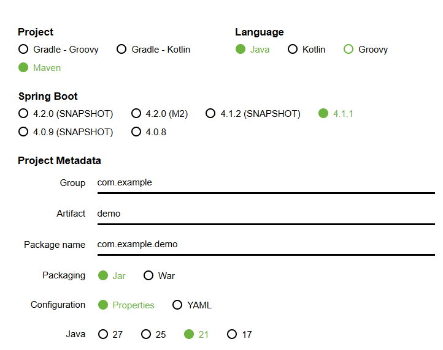
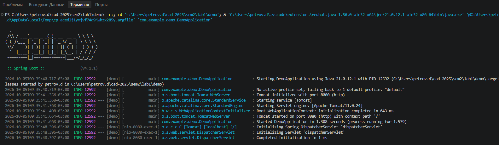
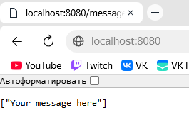
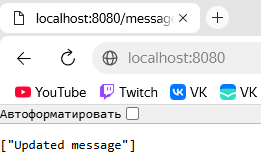
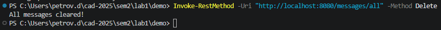
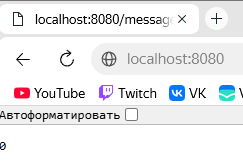
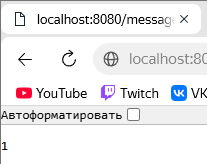

# Лабораторная работа №1. Введение в Spring Boot

## Выполнение работы

### 1. Создан проект Spring Boot через Spring Initializr



### 2. Структура проекта

```
demo/
├── .mvn/
├── .vscode/
├── src/
│   ├── main/
│   │   ├── java/com/example/demo/
│   │   │   ├── DemoApplication.java
│   │   │   └── MessageController.java
│   │   └── resources/
│   │       └── application.properties
│   └── test/java/com/example/demo/
│       └── DemoApplicationTests.java
├── target/
├── .gitattributes
├── .gitignore
├── 1.png
├── 2.png
├── 3.png
├── 4_1.png
├── 4.png
├── 5.png
├── initializr.png
├── HELP.md
├── mvnw
├── mvnw.cmd
├── pom.xml
├── README.md
└── started.png
```

### 3. Добавлена зависимость `spring-boot-starter-web` в `pom.xml`

```xml
<dependency>
    <groupId>org.springframework.boot</groupId>
    <artifactId>spring-boot-starter-web</artifactId>
</dependency>
```

### 4. Создан класс `MessageController`

```java
package com.example.demo;
import org.springframework.web.bind.annotation.*;
import java.util.ArrayList;
import java.util.List;

@RestController
public class MessageController {

    private List<String> userMessages = new ArrayList<>();

    @GetMapping("/")
    public String helloWorld() {
        return "Hello, World!";
    }

    @GetMapping("/messages")
    public List<String> getAllMessages() {
        return userMessages;
    }

    @PostMapping("/messages")
    public String publishMessage(@RequestBody String message) {
        userMessages.add(message);
        return "Message published successfully!";
    }

    @PutMapping("/messages/{index}")
    public String updateMessage(@PathVariable int index, @RequestBody String message) {
        if (index >= 0 && index < userMessages.size()) {
            userMessages.set(index, message);
            return "Message updated successfully!";
        }
        return "Message not found at index " + index;
    }

    @DeleteMapping("/messages/{index}")
    public String deleteMessage(@PathVariable int index) {
        if (index >= 0 && index < userMessages.size()) {
            userMessages.remove(index);
            return "Message deleted successfully!";
        }
        return "Message not found at index " + index;
    }
}
```

## Результат работы

### Запуск приложения



### Публикация сообщения (POST) и проверка в браузере
Запрос в PowerShell:

```powershell
$message = "Your message here"
Invoke-RestMethod -Uri "http://localhost:8080/messages" -Method Post -Body $message -ContentType "application/json"
```

Результат:


### Обновление сообщения (PUT) и проверка в браузере
Запрос в PowerShell:

```powershell
$index = 0
$message = "Updated message"
Invoke-RestMethod -Uri "http://localhost:8080/messages/$index" -Method Put -Body $message -ContentType "application/json"
```

Результат — сообщение по индексу 0 изменено:



### Удаление сообщения (DELETE) и проверка в браузере
Запрос в PowerShell:

```powershell
$index = 0
Invoke-RestMethod -Uri "http://localhost:8080/messages/$index" -Method Delete
```

Результат — сообщение удалено, список пуст:


## Дополнительное задание

### Задание 1. Метод `clearAllMessages()` — очистка всех сообщений

```java
@DeleteMapping("/messages/all")
public String clearAllMessages() {
    userMessages.clear();
    return "All messages cleared!";
}
```

**Проверка:**

Выполняем очистку:

```powershell
Invoke-RestMethod -Uri "http://localhost:8080/messages/all" -Method Delete
```



### Задание 2. Метод `countMessages()` — количество сообщений

```java
@GetMapping("/messages/count")
public int countMessages() {
    return userMessages.size();
}
```

**Проверка:**

После очистки количество — `0`:



После добавления 1 сообщения — `1`:

```powershell
$message = "Test message"
Invoke-RestMethod -Uri "http://localhost:8080/messages" -Method Post -Body $message -ContentType "application/json"
```



### Итоговый код `MessageController` с дополнительными методами

```java
package com.example.demo;

import org.springframework.web.bind.annotation.*;

import java.util.ArrayList;
import java.util.List;

@RestController
public class MessageController {

    private List<String> userMessages = new ArrayList<>();

    @GetMapping("/")
    public String helloWorld() {
        return "Hello, World!";
    }

    @GetMapping("/messages")
    public List<String> getAllMessages() {
        return userMessages;
    }

    @PostMapping("/messages")
    public String publishMessage(@RequestBody String message) {
        userMessages.add(message);
        return "Message published successfully!";
    }

    @PutMapping("/messages/{index}")
    public String updateMessage(@PathVariable int index, @RequestBody String message) {
        if (index >= 0 && index < userMessages.size()) {
            userMessages.set(index, message);
            return "Message updated successfully!";
        }
        return "Message not found at index " + index;
    }

    @DeleteMapping("/messages/{index}")
    public String deleteMessage(@PathVariable int index) {
        if (index >= 0 && index < userMessages.size()) {
            userMessages.remove(index);
            return "Message deleted successfully!";
        }
        return "Message not found at index " + index;
    }

    @DeleteMapping("/messages/all")
    public String clearAllMessages() {
        userMessages.clear();
        return "All messages cleared!";
    }

    @GetMapping("/messages/count")
    public int countMessages() {
        return userMessages.size();
    }
}
```

## Выводы

В ходе выполнения работы:
- изучен Spring Framework и Spring Boot;
- создан проект через Spring Initializr;
- реализован REST-контроллер `MessageController` с методами CRUD
  (`GET`, `POST`, `PUT`, `DELETE`) для работы со списком сообщений;
- проверена работа приложения через браузер и PowerShell;
- выполнено дополнительное задание: реализованы методы
  `clearAllMessages()` (очистка списка) и `countMessages()` (подсчёт количества).

Приложение успешно запускается и обрабатывает все типы HTTP-запросов.